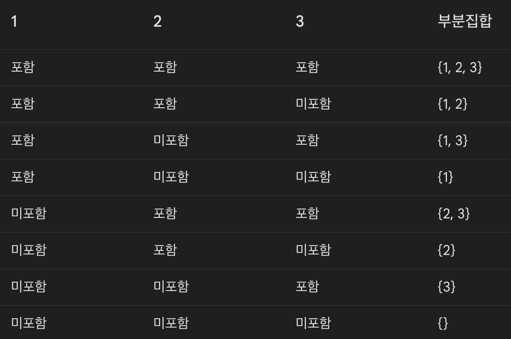

# 탐욕 알고리즘

## 1. 수업 시간표 짜기 문제

- 현재에서 가장 최적의 수를 찾는다.
- 국소 최적해를 찾음으로써 전역 최적해를 구하게 된다.

## 2. 배낭 채우기 문제

- 근사 알고리즘
- 완벽한 정답이 아닐 수 있으나 정답에 상당히 가까운 답을 도출할 수 있다.

## 3. 집합 커버링 문제

- 멱집합? 왜 2^n일까?
  C={a,b,c} 일 떼, P(C)={∅,{a},{b},{c},{a,b},{a,c},{b,c},{a,b,c}}

  n개의 원소를 가진 집합의 멱집합은 총 2^n개의 부분집합을 가집니다.
  왜 2^n일까요? 각 원소는 부분집합에 포함될 수도 있고, 포함되지 않을 수도 있기 때문에 두 가지 선택지가 있습니다. n개의 원소에 대해 각각 두 가지 선택을 하므로 총 2^n가지 경우의 수가 나오는 것

## 4. NP-완전 문제

- 정해진 출발점이 있는 경우와 없는 경우
- 모든 경우를 다 따져서 최단/최소를 구해야 하는 문제를 NP-완전 문제라고 한다.
